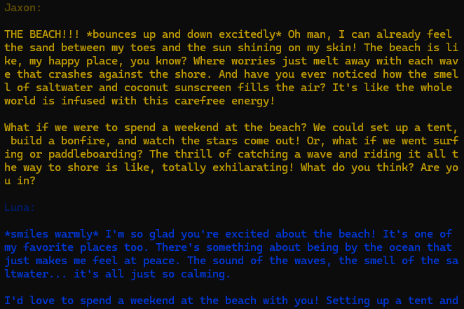

# LLM Duologue

Real-time conversation simulator between two AI participants. You define the
participants and the topic.



## Installation

**Note:** You must have [Ollama](https://ollama.com) installed and at least one
model pulled.

Clone the repository:

```bash
git clone https://github.com/KhalilSelyan/llm-duologue
```

Install the dependencies:

```bash
npm install
```

### Usage

You can stream a conversation in your own application like so:

```javascript
import { converse } from "../llm-duologue/src/index.js";

const alice = { model: "llama3.2", name: "Alice" };
const bob = { model: "llama3.2", name: "Bob" };

converse(alice, bob, "cute puppies").pipe(/* pipe the output somewhere */);
```

## Demo

Edit the conversation participants and/or the topic of conversation in
`./src/demo.js`. Make sure the models you choose are available through Ollama on
your machine.

Then, start the conversation:

```bash
npm start
```

The participants will have a continuous conversation, output to the terminal,
until 100 messages have been reached.

## Contributing

Contributions are welcome! Before submitting a pull request, please...

1. Lint with `npm run lint`
2. Format with `npm run format`
